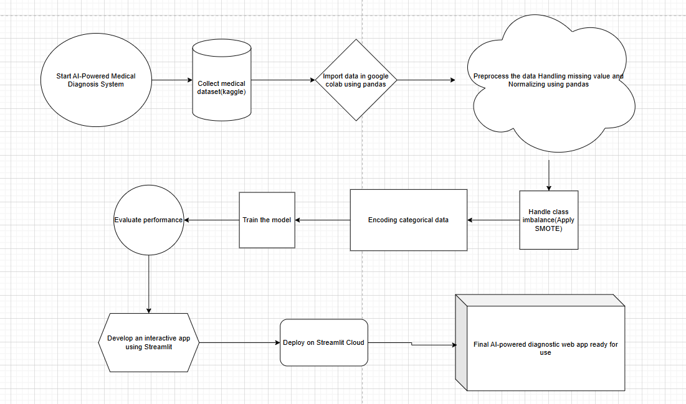
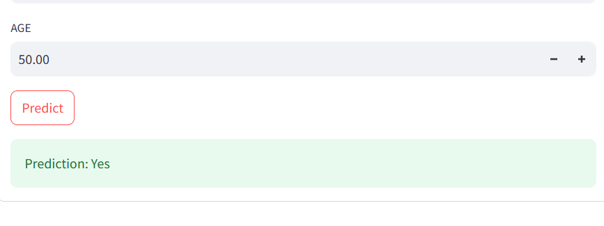

# AI_Medical_Diagnosis_App
This repository contains ML models developed during my AICTE edunet with SAP and Microsoft Internship. It includes preprocessed datasets, Google colab Notebooks, and trained .pkl models for disease prediction (Breast Cancer, Diabetes, Fetal Health, Heart &amp; Kidney Disease, Lung Cancer). and Streamlit app code.

🏥 AI Medical Diagnosis App

📌 Project Overview

This is an AI-powered Medical Diagnosis Application developed during the AICTE Internship. It uses Machine Learning (ML) models to predict diseases based on user input and provides insightful visualizations.

🚀 Features

🏥 AI-driven Disease Prediction using ML models

📊 Interactive Data Visualization with Matplotlib & Seaborn

🌐 User-friendly Web Interface using Streamlit

🔍 Secure Data Handling with Pandas

🖼️ Application Flowchart

🎯 Disease Prediction Example

💻 User Interface (UI)

🛠️ Tech Stack

Python 🐍

Streamlit 🎨

Scikit-Learn 🤖

Pandas & NumPy 📊

📌 How to Run Locally

Step 1: Clone the Repository

git clone https://github.com/0073212/AI_Medical_Diagnosis_App.git
cd AI_Medical_Diagnosis_App

Step 2: Create Virtual Environment & Activate

python -m venv venv
# Windows
venv\Scripts\activate
# Mac/Linux
source venv/bin/activate

Step 3: Install Dependencies

pip install -r requirements.txt

Step 4: Run the App

streamlit run app.py

🤝 Contributing

Feel free to fork the repository, create a new branch, and submit a pull request! 🙌

